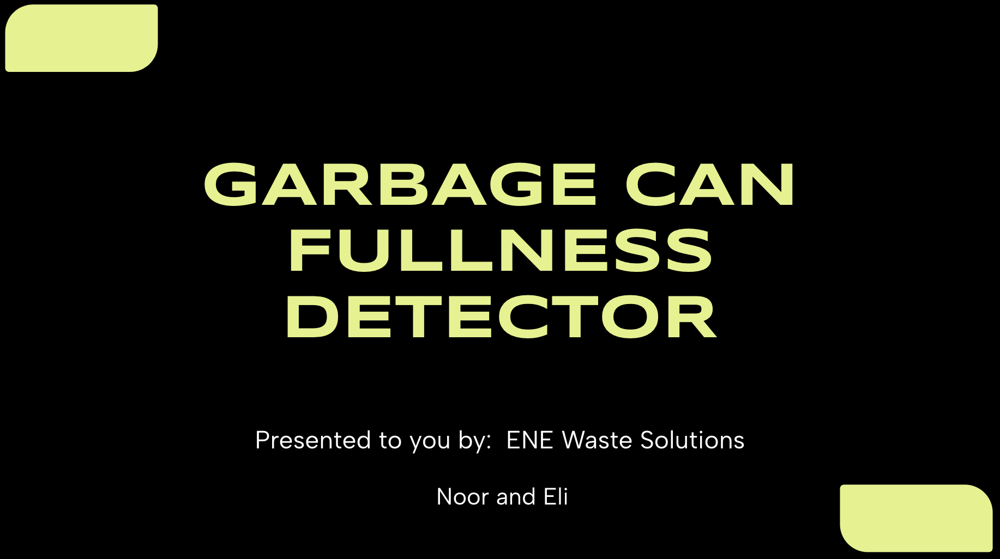
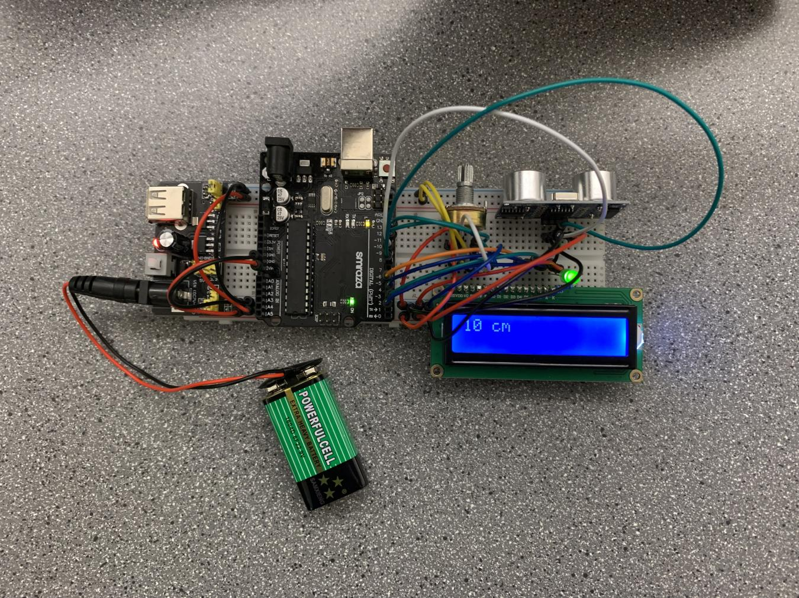

# Garbage Can Fullness Detector by ENE Waste Solutions

ENE Waste are the winners of the Fall 2023 Startup Potential Award.

## The Device

Using an ultrasonic sensor, the device will detect full garbage cans and send a notification to the app. This speeds up janitorial services by ensuring that only full capacity cans are checked and changed out.

[Click here to learn more about ENE Waste Solutions and their device!](https://docs.google.com/presentation/d/1KrGktTArf1kjxgK-ChSeJjblGiiWRsiKoZWizBxd4yY/edit#slide=id.g26204629177_0_716)

## Authors

- Noor
- Eli
- Ethan
